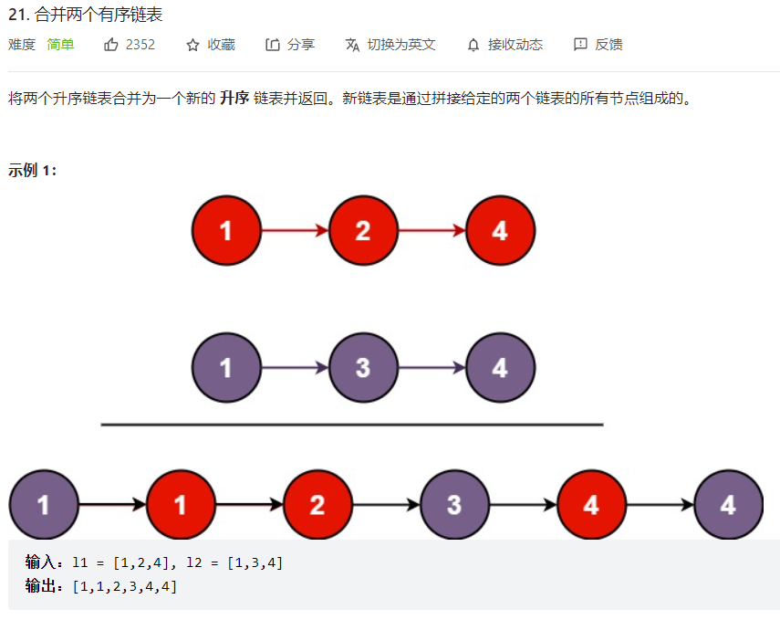

题目描述：




代码如下：

```java
/**
 * Definition for singly-linked list.
 * public class ListNode {
 *     int val;
 *     ListNode next;
 *     ListNode() {}
 *     ListNode(int val) { this.val = val; }
 *     ListNode(int val, ListNode next) { this.val = val; this.next = next; }
 * }
 */
class Solution {
    public ListNode mergeTwoLists(ListNode list1, ListNode list2) {
        if(list1==null&&list2==null){
            return null;
        }
        if(list1==null&&list2!=null){
            return list2;
        }
        if(list1!=null&&list2==null){
            return list1;
        }
        ListNode res = new ListNode(0);
        ListNode cur = res;
        while(list1!=null&&list2!=null){
            if(list1.val<list2.val){
                cur.next = list1;
                list1 = list1.next;
                cur = cur.next;
            }else{
                cur.next = list2;
                list2 = list2.next;
                cur = cur.next;
            }
        }
        if(list1 == null){
            cur.next = list2;
        }else{
            cur.next = list1;
        }
        return res.next;
    }
}
```

