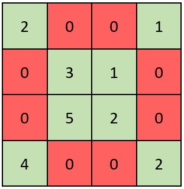

[2319. 判断矩阵是否是一个 X 矩阵](https://leetcode.cn/problems/check-if-matrix-is-x-matrix/)    如果一个正方形矩阵满足下述 全部 条件，则称之为一个 X 矩阵 ：

- 矩阵对角线上的所有元素都 不是 0
- 矩阵中所有其他元素都是 0

给你一个大小为 n x n 的二维整数数组 grid ，表示一个正方形矩阵。如果 grid 是一个 X 矩阵 ，返回 true ；否则，返回 false 。<!--more-->

举例：



> 输入：grid = [[2,0,0,1],[0,3,1,0],[0,5,2,0],[4,0,0,2]]
> 输出：true
> 解释：矩阵如上图所示。
> X 矩阵应该满足：绿色元素（对角线上）都不是 0 ，红色元素都是 0 。
> 因此，grid 是一个 X 矩阵。

## Solution 

```java
class Solution {
    public boolean checkXMatrix(int[][] grid) {
        int length = grid.length;
        for (int i = 0; i < length; i++) {
            int diff = length - i - 1;
            if (grid[i][i] == 0 || grid[i][diff] == 0) return false;
            for (int j = 0; j < length; j++) {
                if (j != i && j != diff) {
                    if (grid[i][j] != 0) return false;
                }
            }
        }
        return true;
    }
}
```
