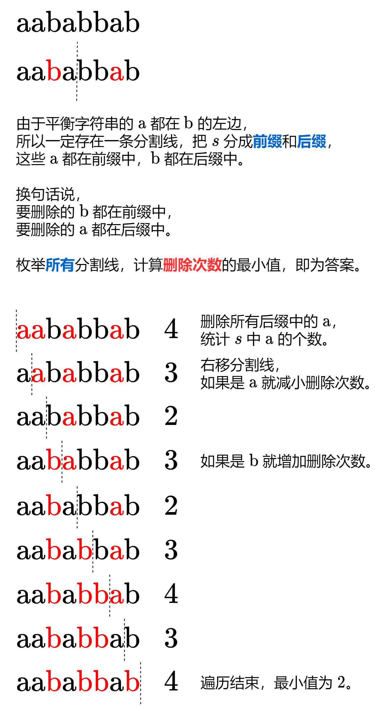

[1653. 使字符串平衡的最少删除次数](https://leetcode.cn/problems/minimum-deletions-to-make-string-balanced/)   给你一个字符串 `s` ，它仅包含字符 'a' 和 'b' 。你可以删除 `s` 中任意数目的字符，使得 `s` **平衡** 。当不存在下标对 (i,j) 满足 i < j ，且 `s[i] = 'b'` 的同时 `s[j]= 'a'` ，此时认为 s 是 **平衡** 的。<!--more-->

请你返回使 s **平衡** 的 **最少** 删除次数。

>  输入：s = "aababbab"
>  输出：2
>  解释：你可以选择以下任意一种方案：
>  下标从 0 开始，删除第 2 和第 6 个字符（"aababbab" -> "aaabbb"），
>  下标从 0 开始，删除第 3 和第 6 个字符（"aababbab" -> "aabbbb"）。

> 输入：s = "bbaaaaabb"
> 输出：2
> 解释：唯一的最优解是删除最前面两个字符。


提示：

- `1 <= s.length <= 105`
- `s[i]` 要么是 `'a'` 要么是 `'b'` 。

## Solution 

```java
class Solution {
    public int minimumDeletions(String s) {
        if (s.length()==1){
            return 0;
        }

        int removeCount = Integer.MAX_VALUE;
        int lastBNum = 0;
        int lastANum = 0;
        for (int i=0;i<s.length();i++){
            if (s.charAt(i)=='a'){
                lastANum++;
            }
        }

        for (int i=0;i<s.length();i++){
            if (s.charAt(i)=='a'){
                lastANum--;
            }

            if (s.charAt(i)=='b'){
                lastBNum++;
                removeCount = Math.min(removeCount, (lastBNum+lastANum-1));
                continue;
            }

            removeCount = Math.min(removeCount, (lastBNum+lastANum));
        }

        return removeCount;
    }
}
```

##  Ideas

方法一：前后缀分解（两次遍历）



通过删除部分字符串，使得字符串达到下列三种情况之一，即为平衡状态：

1. 字符串全为 “a”；
2. 字符串全为 “b”；
3. 字符串既有 “a” 也有 “b”，且所有 “a” 都在所有 “a” 左侧。

其中，为了达到第 1 种情况，最少需要删除所有的 “b”。为了达到第 2 种情况，最少需要删除所有的 “a”。而第 3 种情况，可以在原字符串相邻的两个字符之间划一条间隔，删除间隔左侧所有的 “b” 和间隔右侧所有的 “a” 即可达到。用 leftb 表示间隔左侧的 “b” 的数目，righta 表示间隔左侧的 “a” 的数目，`leftb+righta` 即为当前划分的间隔下最少需要删除的字符数。这样的间隔一共有 n−1 种，其中 n 是 s 的长度。遍历字符串 s，即可以遍历 n−1 种间隔，同时更新 leftb 和 righta 的数目。而上文讨论的前两种情况，其实就是间隔位于首字符前和末字符后的两种特殊情况，可以加入第 3 种情况一并计算。
