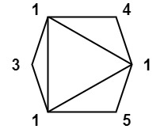

[1039. 多边形三角剖分的最低得分](https://leetcode.cn/problems/minimum-score-triangulation-of-polygon/) 你有一个凸的 `n` 边形，其每个顶点都有一个整数值。给定一个整数数组 `values` ，其中 `values[i]` 是第 `i` 个顶点的值（即 **顺时针顺序** ）。<!--more-->

假设将多边形 **剖分** 为 `n - 2` 个三角形。对于每个三角形，该三角形的值是顶点标记的**乘积**，三角剖分的分数是进行三角剖分后所有 `n - 2` 个三角形的值之和。

返回 *多边形进行三角剖分后可以得到的最低分* 。

举例1：


>  输入：values = [1,2,3]
>  输出：6
>  解释：多边形已经三角化，唯一三角形的分数为 6。

举例2：


> 输入：values = [3,7,4,5]
> 输出：144
> 解释：有两种三角剖分，可能得分分别为：3*7*5 + 4*5*7 = 245，或 3*4*5 + 3*4*7 = 144。最低分数为 144。

举例3：



> 输入：values = [1,3,1,4,1,5]
> 输出：13
> 解释：最低分数三角剖分的得分情况为 1*1*3 + 1*1*4 + 1*1*5 + 1*1*1 = 13。

提示：

- `n == values.length`
- `3 <= n <= 50`
- `1 <= values[i] <= 100`


##  Solutions


```java
class Solution {
    public int minScoreTriangulation(int[] values) {
        int len = values.length;
         int[][] dp = new int[len][len];
         //dp[i][j]表示区间在【i，j】的最低得分

         //递推公式
         //dp[i][j] = dp[i][k]+dp[k+1][j]+v[i]*v[j]*v[k]
         //其中k位于i和j之间

         //遍历方式
         //从中间向两边扩散，还是重两边向中间扩散
         //因为最开始两边是没有值得，向中间扩散后，导致得到的值比实际值小
         //所以应该采取中间向两边扩散
         for(int i = len-1; i >= 0; i--) {
             for(int j = i+2; j < len; j++) {
                 dp[i][j] = Integer.MAX_VALUE;
                 for(int k = i+1; k < j; k++) {
                     dp[i][j] = Math.min(dp[i][j], dp[i][k]+dp[k][j]+values[i]*values[j]*values[k]);
                 }
             }
         }
         return dp[0][len-1];
    }
}
```

##  Ideas

- 方法一：记忆化搜索

  我们设计一个函数 `dfs(i,j)`，表示将多边形的顶点 i 到 j 进行三角剖分后的最低分数。那么答案就是 `dfs(0,n−1)`。

  函数 `dfs(i,j)` 的计算过程如下：
  
  如果 i+1=j，说明多边形只有两个顶点，无法进行三角剖分，返回 0；
  
  否则，我们枚举 i 和 j 之间的一个顶点 k，即 `i<k<j`，将多边形的顶点 i 到 j 进行三角剖分，可以分为两个子问题：将多边形的顶点 i 到 k 进行三角剖分，以及将多边形的顶点 k 到 j 进行三角剖分。这两个子问题的最低分数分别为 `dfs(i,k)` 和 `dfs(k,j)`，而顶点 i, j 和 k 构成的三角形的分数为 `values[i]×values[k]×values[j]`。那么，此次三角剖分的最低分数为 `dfs(i,k)+dfs(k,j)+values[i]×values[k]×values[j]`，我们取所有可能的最小值，即为 `dfs(i,j)` 的值。
  
  为了避免重复计算，我们可以使用记忆化搜索，即使用哈希表或者数组来存储已经计算过的函数值。
  
  最后，我们返回 `dfs(0,n−1)` 即可。
  
  ```java
  class Solution {
      private int n;
      private int[] values;
      private Integer[][] f;
  
      public int minScoreTriangulation(int[] values) {
          n = values.length;
          this.values = values;
          f = new Integer[n][n];
          return dfs(0, n - 1);
      }
  
      private int dfs(int i, int j) {
          if (i + 1 == j) {
              return 0;
          }
          if (f[i][j] != null) {
              return f[i][j];
          }
          int ans = 1 << 30;
          for (int k = i + 1; k < j; ++k) {
              ans = Math.min(ans, dfs(i, k) + dfs(k, j) + values[i] * values[k] * values[j]);
          }
          return f[i][j] = ans;
      }
  }
  ```
  
  
  
- 方法二：动态规划

  

  
