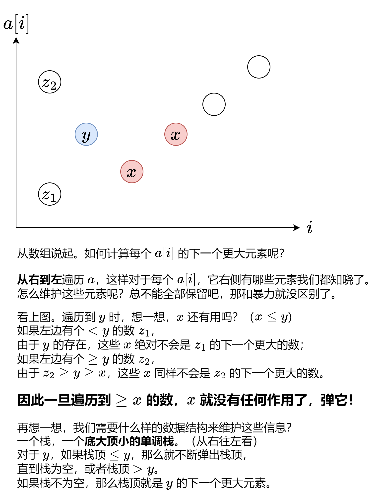

[1019. 链表中的下一个更大节点](https://leetcode.cn/problems/next-greater-node-in-linked-list/)  给定一个长度为 `n` 的链表 `head`<!--more-->

对于列表中的每个节点，查找下一个 **更大节点** 的值。也就是说，对于每个节点，找到它旁边的第一个节点的值，这个节点的值 **严格大于** 它的值。

返回一个整数数组 `answer` ，其中 `answer[i]` 是第 i 个节点( 从1开始 )的下一个更大的节点的值。如果第 i 个节点没有下一个更大的节点，设置 `answer[i] = 0` 。

举例1


>  输入：head = [2,1,5]
>  输出：[5,5,0]

举例2


> 输入：head = [2,7,4,3,5]
> 输出：[7,0,5,5,0]

提示：

- 链表中节点数为 `n`
- `1 <= n <= 104`
- `1 <= Node.val <= 109`


##  Solutions


```java
/**
 * Definition for singly-linked list.
 * public class ListNode {
 *     int val;
 *     ListNode next;
 *     ListNode() {}
 *     ListNode(int val) { this.val = val; }
 *     ListNode(int val, ListNode next) { this.val = val; this.next = next; }
 * }
 */
class Solution {
    public int[] nextLargerNodes(ListNode head) {
        if (head == null) {
            return null;
        }
        
        // 1. 创建一个容器 list 来存储数据
        ArrayList<Integer> list = new ArrayList<>();
        int size = 0;
        while (head != null) {
            list.add(head.val);
            size++;
            head = head.next;
        }
        // 2. 创建一个栈 stack ，这个栈里面存储的是对应位置的 list 元素及其之后元素中最大的值。
        Stack<Integer> stack = new Stack<>();
        int[] ans = new int[size]; 
        // 3. 在 list 中从右往左遍历，stack 中凡是比 list.get(i) 小的都 pop 出去，
        // 这样 stack 剩下的元素都是比 list.get(i) 更大的元素。
        for (int i = list.size() - 1; i >= 0; i--) {
            while (!stack.empty() && stack.peek() <= list.get(i)) {
                stack.pop();
            }
            ans[i] = stack.empty() ? 0 : stack.peek();
            stack.push(list.get(i));
        }
        return ans;
    }
}
```

##  Ideas

- 

  
